# Ashdorah Prime — ServiceNow GRC / IRM Portfolio

A hands-on governance, risk and compliance portfolio demonstrating how cybersecurity risks can be identified, assessed, mapped to controls and frameworks, monitored, remediated and reported using ServiceNow IRM.

> **Portfolio scenario:** Ashdorah Prime is a fictional cloud-based organisation created for this practical GRC implementation project. The environment and evidence shown here are for demonstration and learning purposes.

---

## Project Overview

This project demonstrates an end-to-end GRC operating model built around ServiceNow IRM, AWS, Microsoft 365 and ISO/IEC 27001:2022.

The implementation covers:

- Cyber risk identification and assessment
- Inherent and residual risk scoring
- Control design and effectiveness
- Unified control mapping across multiple frameworks
- Continuous control monitoring
- Automated GRC issue creation
- Remediation and control recovery
- Policy exception governance
- AI governance
- ISO/IEC 27001:2022 Statement of Applicability
- Risk reporting through ServiceNow Risk Workspace

---

## Technology Used

- ServiceNow IRM / GRC
- ServiceNow Risk Workspace
- ServiceNow Workflow Studio
- AWS Lambda
- AWS Security Groups
- Microsoft Entra ID
- Microsoft Purview DLP
- Microsoft Excel
- REST APIs
- GitHub

---

## Governance Frameworks

The project demonstrates control alignment across:

- ISO/IEC 27001:2022
- NIST Cybersecurity Framework 2.0
- CIS Controls v8
- CIS AWS Foundations Benchmark
- CSA Cloud Controls Matrix
- SOC 2 Trust Services Criteria
- UK Cyber Essentials

The AI governance extension also incorporates:

- ISO/IEC 42001:2023
- NIST AI Risk Management Framework 1.0

---

## Risk Management

Nine risks were assessed across the main business environment and the AI governance extension.

### Cyber Risks

| Risk | Scenario | Inherent | Residual |
|---|---|---:|---:|
| R-001 | Unauthorized access to customer data | High (20) | Low (2) |
| R-002 | Employee laptop theft/loss | Low (12) | Low (4) |
| R-003 | Cloud misconfiguration | Moderate (16) | Low (6) |
| R-004 | Insider threat | Moderate (15) | Low (6) |
| R-005 | Third-party breach | Moderate (15) | Low (6) |
| R-006 | Business continuity failure | Moderate (15) | Low (6) |

### AI Risks

| Risk | Scenario | Inherent | Residual |
|---|---|---:|---:|
| AI-001 | Sensitive data leakage through AI prompts/output | High (20) | Moderate (10) |
| AI-002 | Model drift or unreliable AI output | Moderate (16) | Moderate (12) |
| AI-003 | AI provider/model supply-chain compromise | Low (12) | Low (8) |

### Risk Workspace Overview

The dashboard provides a consolidated view of inherent risk, control effectiveness and residual risk.

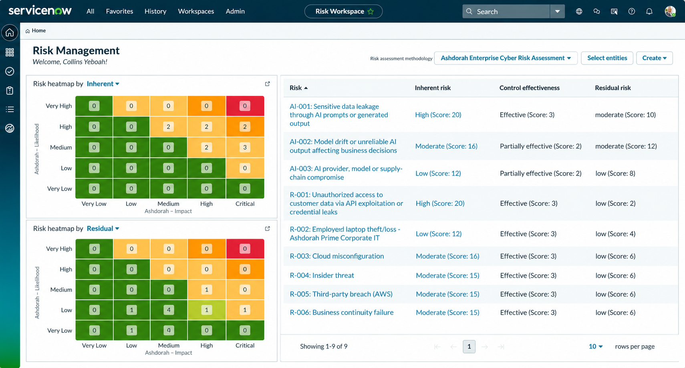

---

## R-003 Cloud Misconfiguration — Risk Treatment Example

R-003 demonstrates how controls reduce a cloud security risk from:

**Inherent Risk: Moderate (16)**  
→ **Control Effectiveness: Effective (3)**  
→ **Residual Risk: Low (6)**

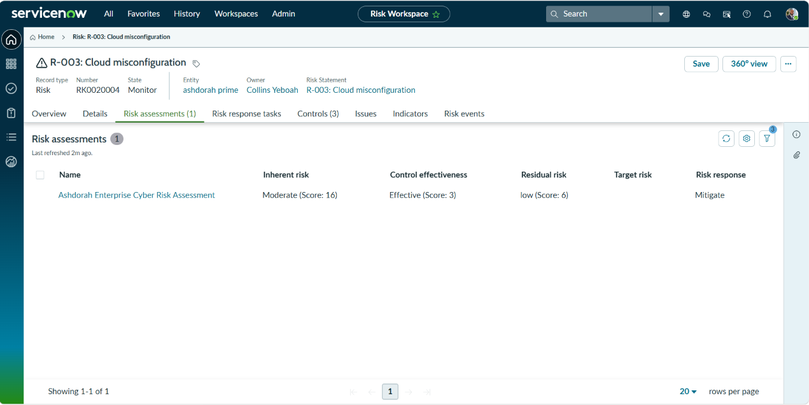

The risk movement is also represented through the configured risk heatmap.

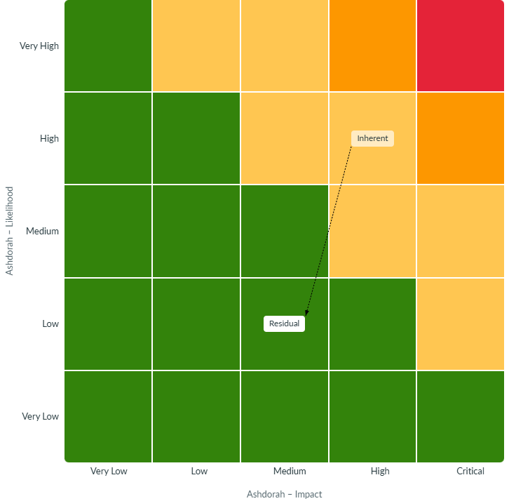

---

## Unified Control Framework

Rather than creating completely separate controls for every security framework, the project uses common control objectives and operational controls that can be mapped to multiple frameworks.

For example, the Cloud Network Security Control is supported by citations from frameworks including:

- ISO/IEC 27001:2022
- NIST CSF 2.0
- CIS Controls
- CIS AWS Foundations Benchmark
- CSA CCM
- SOC 2
- Cyber Essentials

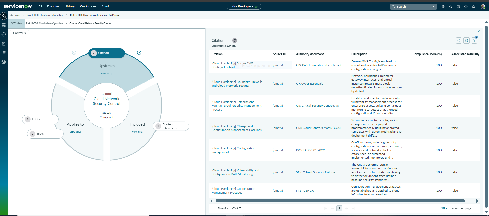

This demonstrates a many-to-one control mapping approach that reduces duplicated compliance activity.

---

## Continuous Control Monitoring & Automation

A practical AWS-to-ServiceNow continuous control monitoring workflow was implemented.

### Workflow

**AWS Security Group Misconfiguration**  
→ **AWS Lambda Detects Failure**  
→ **REST API Sends Finding to ServiceNow**  
→ **ServiceNow Creates GRC Issue**  
→ **Issue Links to Cloud Network Security Control**  
→ **Remediation Performed**  
→ **Issue Closed**  
→ **Control Returns to Compliant**

### 1. AWS Lambda Detection

The Lambda control check detects unrestricted inbound SSH access and returns a FAIL result.

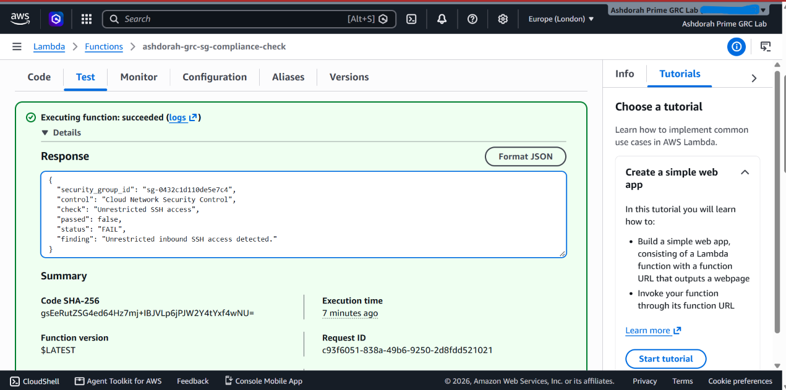

### 2. REST Integration

The finding is successfully submitted to ServiceNow through the REST API.

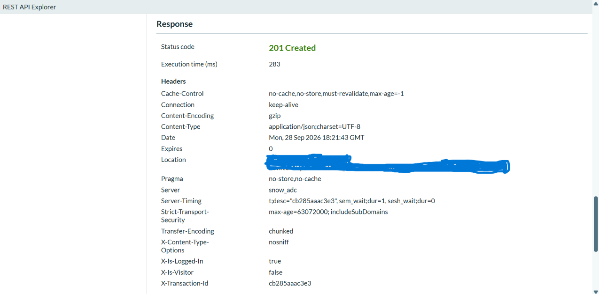

### 3. GRC Issue and Remediation

ServiceNow creates an issue for the failed control and links it to the Cloud Network Security Control.

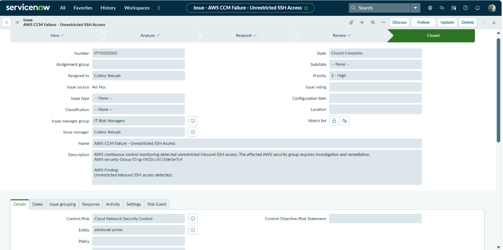

### 4. Control Recovery

After remediation, the Cloud Network Security Control returns to:

**State: Monitor**  
**Status: Compliant**

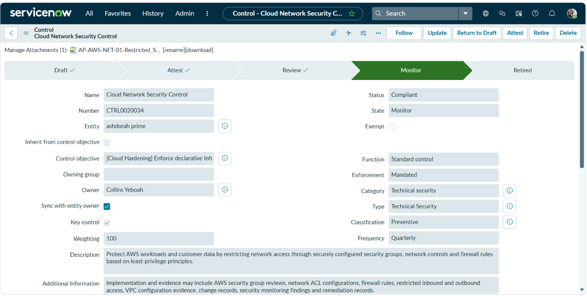

---

## Policy Exception Management

A temporary MFA exception was created to demonstrate formal exception governance for a legacy service account that could not support interactive MFA.

The workflow includes:

- Business justification
- Compensating controls
- Named requester
- Compliance approval group
- Named approver
- Defined validity period
- Formal approval state

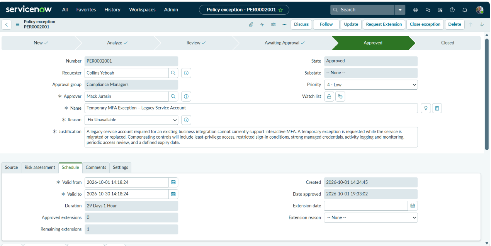

This demonstrates that a control exception is governed, approved and time-bound rather than treated as an undocumented security bypass.

---

## AI Governance Extension

The project was extended to cover governance of the fictional **Ashdorah Predictive Insights AI Engine**.

AI governance controls address:

- AI data handling and prompt protection
- AI activity logging and monitoring
- Reliability and human oversight
- AI supplier due diligence
- Model and supplier assurance

AI controls are mapped against:

- ISO/IEC 27001:2022
- ISO/IEC 42001:2023
- NIST AI RMF 1.0

Example:

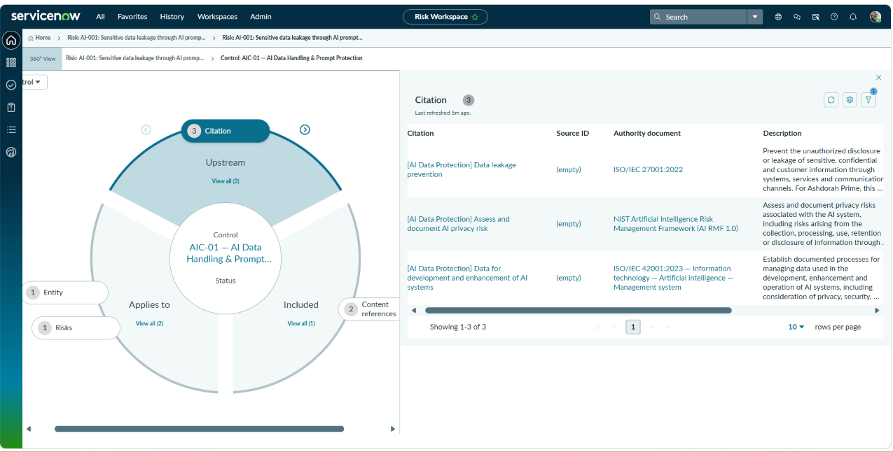

---

## ISO/IEC 27001:2022 Statement of Applicability

A complete ISO/IEC 27001:2022 Annex A Statement of Applicability was developed and reconciled against the ServiceNow implementation.

### SoA Summary

| Measure | Count |
|---|---:|
| Total Controls | 93 |
| Applicable | 85 |
| Implemented | 72 |
| Partial | 10 |
| Planned | 3 |
| Not Applicable | 8 |

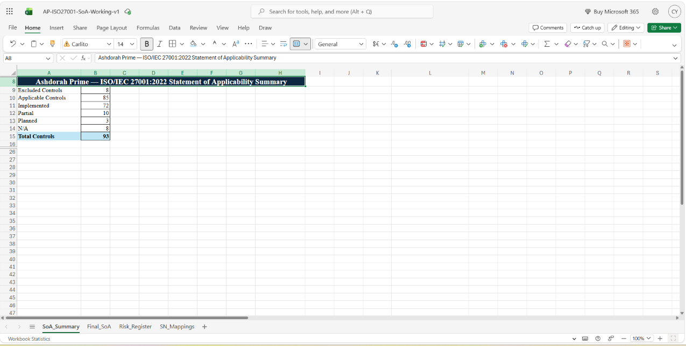

The detailed SoA links selected ISO controls to ServiceNow citations, mapped control objectives, related risks, residual risk and operational evidence.

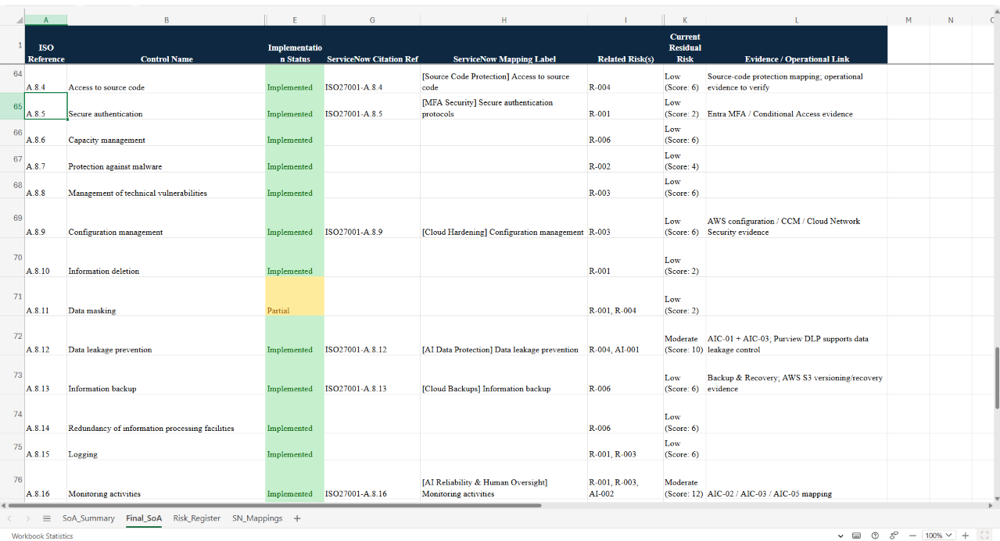

---

## Key Skills Demonstrated

This portfolio demonstrates practical capability in:

- GRC / IRM implementation
- Cyber risk assessment
- Inherent vs residual risk analysis
- Risk treatment
- Control design
- Control effectiveness assessment
- ISO 27001 control mapping
- Statement of Applicability development
- Multi-framework harmonisation
- Policy exception management
- Continuous control monitoring
- ServiceNow Workflow Studio
- REST API integration
- AWS security monitoring
- Automated remediation workflows
- AI risk and governance
- Evidence management
- Risk reporting and dashboards
- Excel XLOOKUP and GRC data reconciliation

---

## Evidence Structure

```text
Evidence/
├── 01-risk-management/
├── 02-unified-framework/
├── 03-continuous-control-monitoring/
├── 04-policy-exception/
├── 05-ai-governance/
└── 06-iso27001-soa/
